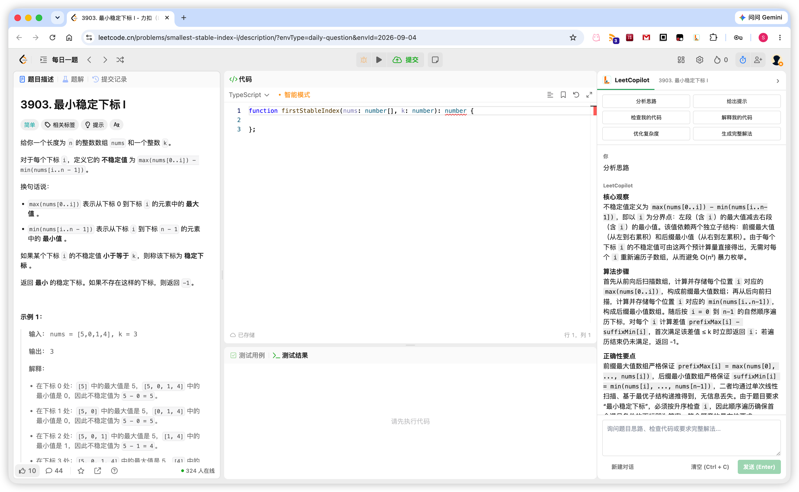
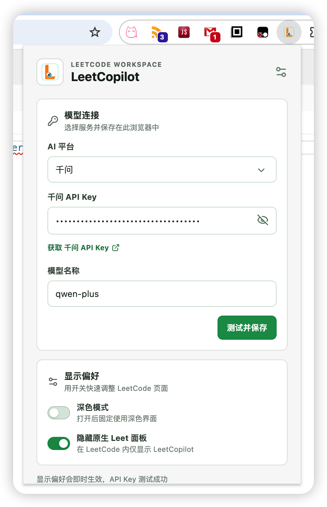
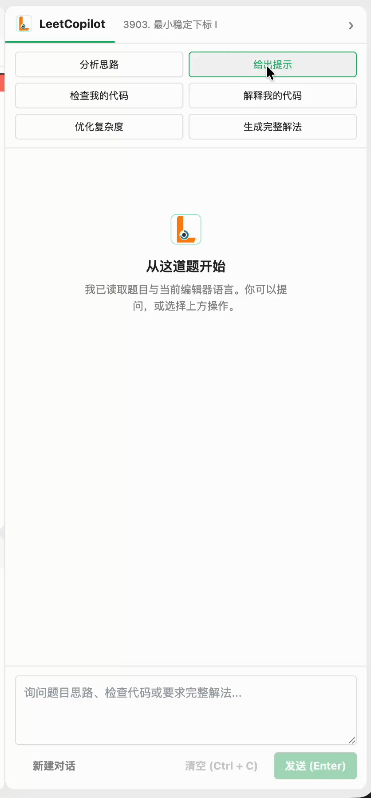

<p align="center"><a href="https://github.com/Suvern/LeetCopilot" target="_blank" rel="noreferrer noopener"></a></p>

<h2 align="center">LeetCopilot</h2>

<p align="center">LeetCopilot 是一个 <strong>免费、</strong> <strong>开源 </strong> 的 LeetCode AI 辅助工具</p>

只需要填入你的 API Key 即可在 AI 辅助下高效刷题，现支持 [DeepSeek](https://platform.deepseek.com/) 和 [千问](https://www.qianwenai.com/)

> 暂时仅支持 `leetcode.cn` 中文站
## 功能

- 基于当前题目、编程语言和当前代码提问，助手栏会流式输出思路和解法
- 隐藏 LeetCode 需要付费的 "Leet" 助手
- 支持深色模式

LeetCopilot 没有后端和服务器，在弹窗中填写 API 密钥后，密钥会保存在 Chrome 的扩展本地存储中，无需担心泄露

## 预览

| 工作区 | 设置 |
| --- | --- |
|  |  |
|  |  |

## 安装

### 从 Release 安装

1. 前往 [Releases 页面](https://github.com/Suvern/LeetCopilot/releases)，下载最新版本的压缩包
2. 解压下载的压缩包
3. 打开 Chrome 的扩展程序设置页面：`chrome://extensions`
4. 开启右上角的“开发者模式”
5. 点击“加载已解压的扩展程序”
6. 选择刚才解压出来的扩展目录

安装完成后，在支持的题目页面打开 LeetCopilot 弹窗，并配置服务商 API 密钥

### 从源码安装

需要 Node.js 20 或更高版本

```bash
pnpm install
pnpm run build
```

1. 打开 `chrome://extensions`，开启“开发者模式”，点击“加载已解压的扩展程序”，选择生成的 `dist/` 目录

2. 在题目页面打开 LeetCopilot 弹窗，并配置服务商 API 密钥

## 开发

```bash
pnpm run typecheck
pnpm test
pnpm run lint
pnpm run build
pnpm run package
```

`pnpm run package` 会生成 `release/LeetCopilot-<version>.zip`

## 发布

发布仅接受稳定的三段版本：tag 使用 `vX.Y.Z`，而 `package.json`、Chrome Manifest 和 zip 文件名使用不含 `v` 的 `X.Y.Z`。准备新版本时，先用命令同步两个版本文件：

```bash
pnpm release 0.1.0
pnpm run check:version
pnpm run package
```

确认检查通过后提交并推送对应的 tag：

```bash
git add package.json public/manifest.json
git commit -m "chore: release v0.1.0"
git tag v0.1.0
git push origin main v0.1.0
```

推送符合 `vX.Y.Z` 的稳定版本 tag 后，GitHub Actions 会校验 tag 与两个版本文件一致，构建并创建对应的 GitHub Release。最终文件名为 `LeetCopilot-X.Y.Z.zip`。

## 支持语言

支持 `C`、`C++`、`Java`、`JavaScript` 和 `Python`

## TODO

- 支持更多编程语言
- 为常见的 LeetCopilot 请求增加编辑器右键菜单操作
- 支持国际站

## 许可证

[MIT](LICENSE)
